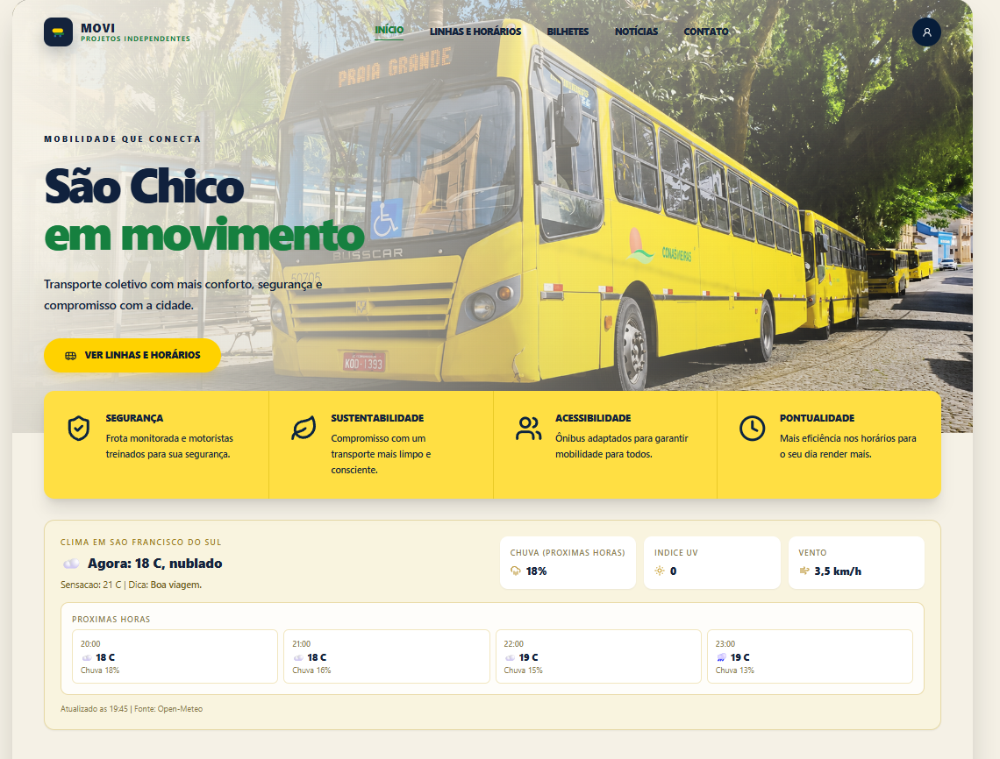

# MOVI — Projetos Independentes

Plataforma pública de mobilidade urbana para São Francisco do Sul e região, com foco em consulta de linhas, horários, paradas, rotas e modais hidroviários.

O projeto é independente e organiza dados públicos para facilitar a experiência de busca de transporte no dia a dia.

## Status

- Frontend e backend integrados
- Dados reais carregados no fluxo principal
- Mapa interativo com linhas e paradas
- Autenticação, favoritos e recuperação de senha
- Base PWA ativa (manifest + service worker + offline básico)

## Contexto do projeto

### Propósito

O MOVI nasceu para organizar, em um só lugar, informações públicas de mobilidade urbana que normalmente ficam espalhadas entre sites, imagens, redes sociais e comunicados.

### Dores reais que o projeto resolve

- Dificuldade de encontrar horários e rotas de forma rápida.
- Falta de uma visualização clara por linha, sentido e paradas.
- Baixa previsibilidade para quem depende de transporte no dia a dia.
- Experiência confusa em mobile para consulta rápida “na rua”.

### Por que esse projeto foi criado

- Consolidar dados públicos em uma experiência útil e simples para a população.
- Criar um produto funcional de ponta a ponta como projeto independente.
- Evoluir habilidades práticas em arquitetura, frontend, backend, dados, UX e PWA.

### Principais dificuldades encontradas

- Fontes com formatos diferentes e dados incompletos/inconsistentes.
- Ajuste fino entre linha, sentido, paradas e trajetória no mapa.
- Evitar chamadas inválidas e estados quebrados no frontend.
- Garantir estabilidade de build/dev sem perder velocidade de iteração.
- Manter qualidade (type-check, lint, testes e build) durante mudanças frequentes.

## Stack

### Frontend

- Next.js 15
- React 19
- TypeScript
- Tailwind CSS
- Leaflet / React-Leaflet

### Backend

- Node.js
- Express
- TypeScript
- Prisma
- SQLite (desenvolvimento)

### Qualidade

- Vitest
- Testing Library
- ESLint

## Estrutura do monorepo

```text
.
├─ apps/
│  ├─ backend/
│  └─ frontend/
├─ packages/
│  └─ shared/
├─ docs/
├─ scripts/
├─ package.json
└─ README.md
```

## Principais funcionalidades

- Home pública com navegação rápida
- Página unificada de linhas e horários
- Mapa da linha selecionada, com sentido e paradas
- Área de ferry boat integrada ao fluxo de linhas
- Página de bilhetes e tarifas
- Página de notícias com conteúdos externos
- Página de contato institucional do projeto
- Login, cadastro e perfil
- Favoritos por sessão autenticada
- Recuperação de senha por e-mail (Brevo)
- Widget de clima na home (Open-Meteo)

## PWA

Implementação atual:

- `manifest.webmanifest`
- registro de service worker em produção
- cache de assets estáticos
- fallback offline para navegação básica

Observação:

- O app não depende de cache agressivo de dados dinâmicos de transporte.

## Como rodar localmente

### Pré-requisitos

- Node.js 20+
- npm 10+

### Instalação

```bash
npm install
```

### Subir projeto completo (backend + frontend)

```bash
npm run dev
```

O comando `npm run dev` já executa preparação automática do banco para ambiente local.

### Rodar serviços separadamente

```bash
npm run dev:backend
npm run dev:frontend
```

## Scripts principais

```bash
npm run dev
npm run build
npm run lint
npm run type-check
npm run test
```

## Variáveis de ambiente

Arquivo principal: `.env` na raiz.

Exemplo mínimo para autenticação e reset de senha:

```env
JWT_SECRET=troque-por-um-segredo-forte
APP_URL=http://localhost:3000

BREVO_API_KEY=sua-chave-brevo
BREVO_SENDER_EMAIL=seu-email-remetente
BREVO_SENDER_NAME=MOVI
```

> Em produção, altere `APP_URL` para a URL pública do deploy.

## Banco de dados e dados de transporte

O backend usa Prisma + SQLite em desenvolvimento.

Para garantir dados de transporte no ambiente local, o fluxo recomendado é usar `npm run dev`, que já chama a preparação de banco configurada no monorepo.

## Deploy

Fluxo recomendado:

1. Rodar validações locais
2. Subir no GitHub
3. Deploy na Vercel (frontend) e backend conforme ambiente escolhido

Checklist antes do deploy:

- `npm run type-check`
- `npm run lint`
- `npm run test`
- `npm run build`

## Capturas de tela

1. Home



2. Linhas e horários


3. Bilhetes 1.0


4. Bilhetes 2.0


5. Notícias


## Aviso de independência

O MOVI é um projeto independente, sem vínculo oficial com empresas operadoras de transporte, órgãos governamentais ou entidades municipais.

As informações exibidas são organizadas a partir de fontes públicas e podem sofrer alterações nas fontes originais.

## Desenvolvedora

- **Luana Groth**
- LinkedIn: [linkedin.com/in/luana-groth](https://www.linkedin.com/in/luana-groth/)
- GitHub: [github.com/Luanagroth](https://github.com/Luanagroth)
- Portfólio: [luana-groth-portfolio.vercel.app](https://luana-groth-portfolio.vercel.app/)

---

© 2026 MOVI — Projetos Independentes
